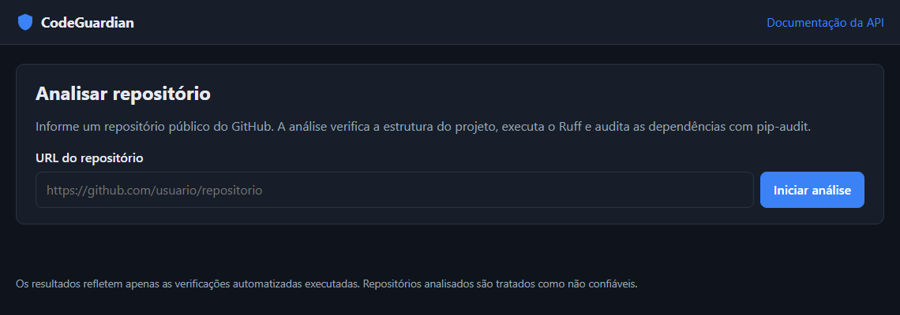
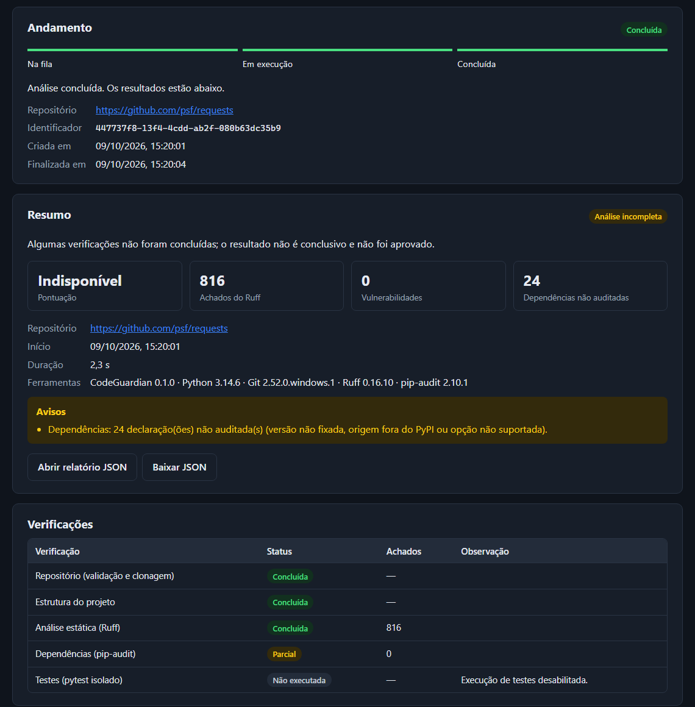
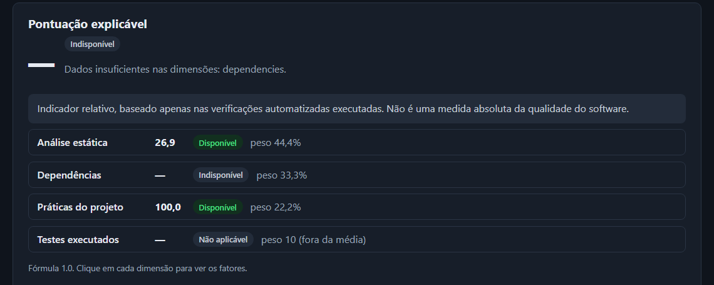
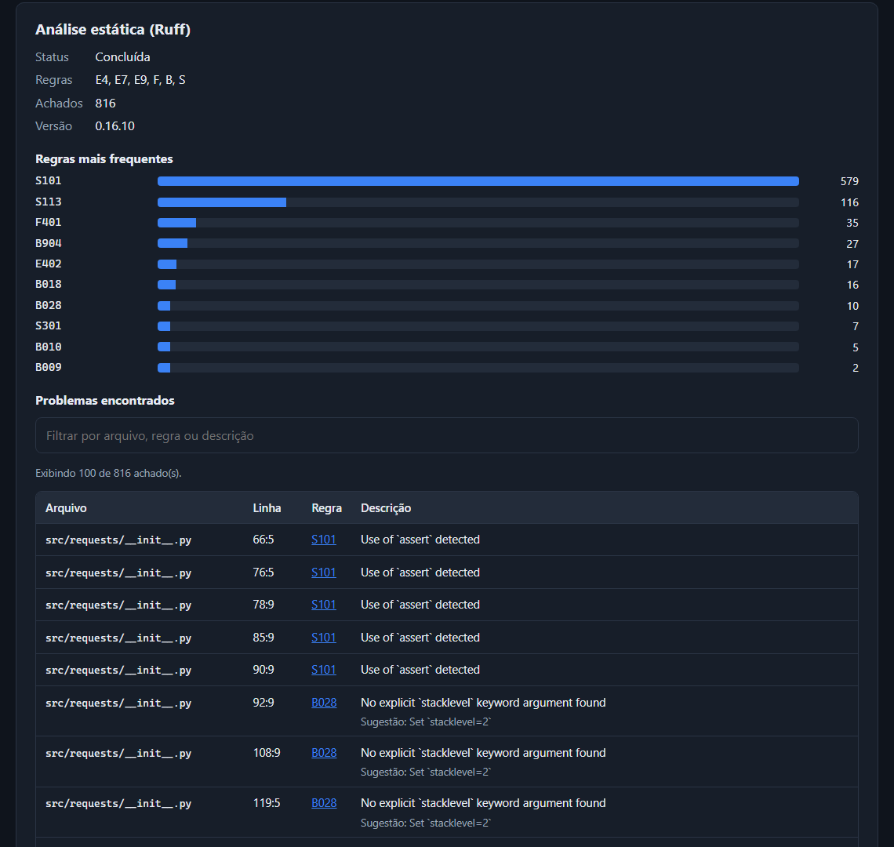

# CodeGuardian

Ferramenta para analisar repositórios Git públicos do GitHub: verifica a estrutura do
projeto, executa análise estática com Ruff, audita dependências com pip-audit e gera um
relatório técnico consolidado, com pontuação explicável, API REST e interface web.

> **Projeto de portfólio para uso local.** A API não tem autenticação e a análise roda no
> mesmo host da API; não exponha o serviço publicamente sem os controles descritos em
> [docs/clonagem.md](docs/clonagem.md) e [docs/api.md](docs/api.md).

## O problema

Avaliar rapidamente um repositório de terceiros (qualidade, dependências vulneráveis,
existência de testes) exige rodar várias ferramentas e interpretar saídas diferentes. E o
próprio processo é arriscado: o repositório é **código não confiável**, que pode tentar
executar comandos, acessar a rede interna, esgotar recursos ou enganar quem lê os
resultados.

O CodeGuardian automatiza essas verificações tratando o repositório estritamente como
**dado**: nada do repositório é executado fora de um container isolado, nenhuma
dependência dele é instalada, e os resultados distinguem claramente "sem achados",
"análise incompleta" e "falha".

## Funcionalidades

- **Validação de URL** com lista de permissões (`https://github.com/<usuário>/<repo>`),
  bloqueando credenciais, IPs, localhost e endereços internos.
- **Clonagem controlada**: rasa, sem credenciais do host, sem configurações globais do
  Git, com limites de tempo, tamanho e saída, e limpeza garantida.
- **Análise estrutural**: arquivos Python, configurações, testes e documentação, sem
  seguir links simbólicos.
- **Análise estática com Ruff**, ignorando a configuração do repositório analisado.
- **Vulnerabilidades em dependências com pip-audit**, sem instalar nada.
- **Relatório consolidado em JSON**, com status por verificação, versões das ferramentas,
  avisos e erros — análises incompletas nunca são aprovadas.
- **Pontuação explicável** (0–100) com fatores, que fica indisponível quando faltam dados.
- **API REST assíncrona** (FastAPI) e **interface web** sem dependências de frontend.
- **Opcionais**, desligados por padrão: execução dos testes do repositório em **container
  Docker isolado** e **explicações com IA local** (Ollama).

## Capturas de tela

Telas reais da interface web, de uma análise do repositório
[psf/requests](https://github.com/psf/requests) feita em 09/10/2026 com o CodeGuardian
0.1.0 (sem dados simulados; execução de testes e IA desabilitadas).

**Tela inicial**



**Andamento, resumo e status de cada verificação** — a análise fica `incomplete` porque
24 dependências declaradas com faixas de versão não puderam ser auditadas.



**Pontuação explicável** — indisponível neste caso, pois a dimensão de dependências não
tem cobertura suficiente; as demais dimensões continuam visíveis com seus pesos.



**Achados do Ruff** — regras mais frequentes e lista com arquivo, linha, regra, descrição
e sugestão, com filtro e paginação.



## Arquitetura

```
Navegador ──► Interface web (app/static) ─┐
Cliente HTTP ─────────────────────────────┴─► API FastAPI (app/api.py, explanations_api.py)
                                                 │  POST /analyses → 202 (fila em memória)
                                                 ▼
                                          JobManager (app/jobs.py, pool limitado de threads)
                                                 │
                                                 ▼
                              analyze_repository (app/analysis_report.py)
   repository_url ─► repository_clone ─► structure_analyzer ─► ruff_analyzer ─► dependency_audit
     (validação)      (git, temporário)    (metadados)          (subprocesso)    (subprocesso)
                                                 │                    └─► test_runner (Docker, opcional)
                                                 ▼
                         AnalysisReport + quality_score ─► JSON / interface
                                                 └─► ai_explainer (Ollama local, opcional, sob demanda)
```

Todas as ferramentas externas (Git, Ruff, pip-audit, Docker) rodam por
`app/process_runner.py`: lista de argumentos sem shell, ambiente mínimo sem segredos,
timeout e limite de saída. Detalhes por etapa nas seções abaixo e em [docs/](docs/).

## Tecnologias

| Uso | Tecnologia |
|---|---|
| Linguagem | Python 3.14 (testado também em 3.13) |
| API e validação | FastAPI, Uvicorn, Pydantic |
| Análise | Git, Ruff, pip-audit, packaging |
| Testes e qualidade | pytest, HTTPX (TestClient), Ruff |
| Interface | HTML, CSS e JavaScript sem framework |
| Opcionais | Docker (testes isolados), Ollama (IA local) |

## Instalação (ambiente limpo)

Requisitos: **Python 3.13 ou 3.14** e **Git** no `PATH`. O `pyproject.toml` declara
Python ≥ 3.12, mas a versão 3.12 não foi testada.

Windows (PowerShell):

```powershell
git clone https://github.com/zJefferson/CodeGuardian.git
cd CodeGuardian
py -3.14 -m venv .venv
.\.venv\Scripts\Activate.ps1
python -m pip install -r requirements.txt
```

Linux/macOS:

```bash
git clone https://github.com/zJefferson/CodeGuardian.git
cd CodeGuardian
python3 -m venv .venv
source .venv/bin/activate
python -m pip install -r requirements.txt
```

O `requirements.txt` fixa todas as versões, incluindo as transitivas, para instalações
reproduzíveis. As dependências diretas estão declaradas em `pyproject.toml`.

**Configuração.** Nenhuma configuração é necessária para o uso básico. As
funcionalidades opcionais são ativadas por variáveis de ambiente do processo da API,
listadas em [.env.example](.env.example). O arquivo `.env` **não é carregado
automaticamente**: defina as variáveis no terminal antes de iniciar o servidor.

## Executando a API

Com o ambiente virtual ativado:

```powershell
uvicorn app.main:app --reload
```

- Interface web: <http://127.0.0.1:8000/>
- API: <http://127.0.0.1:8000/analyses>
- Verificação de saúde: <http://127.0.0.1:8000/health> → `{"status": "ok"}`
- Documentação interativa (Swagger): <http://127.0.0.1:8000/docs>

`--reload` é apenas para desenvolvimento. Por padrão o servidor escuta somente em `127.0.0.1`.
Use um único worker: as análises e seus resultados ficam na memória do processo.

### Endpoints

| Método e rota | Descrição |
|---|---|
| `POST /analyses` | inicia uma análise (`{"repository_url": "https://github.com/..."}`) e responde `202` |
| `GET /analyses/{analysis_id}` | status: `queued`, `running`, `completed` ou `failed` |
| `GET /analyses/{analysis_id}/report` | relatório JSON (`409` enquanto não estiver pronto) |
| `POST /analyses/{analysis_id}/explanations` | explicação de um achado com IA local (opcional) |
| `GET /ai/status` | indica se as explicações com IA estão habilitadas |
| `GET /health` | verificação de saúde |

```powershell
$r = Invoke-RestMethod -Method Post http://127.0.0.1:8000/analyses -ContentType "application/json" -Body '{"repository_url": "https://github.com/psf/requests"}'
Invoke-RestMethod "http://127.0.0.1:8000$($r.status_url)"
Invoke-RestMethod "http://127.0.0.1:8000$($r.report_url)"
```

Códigos HTTP, formato de erros, limites e restrições da execução em segundo plano:
[docs/api.md](docs/api.md).

## Testes e verificações

```powershell
pytest                # testes
pytest -v             # testes com saída detalhada
ruff check .          # lint
ruff format --check . # formatação
pip-audit -r requirements.txt  # vulnerabilidades conhecidas nas dependências
```

## Validação de repositórios

`app/repository_url.py` aceita somente URLs no formato
`https://github.com/<usuário>/<repositório>` (opcionalmente com `.git` ou `/` final).
São rejeitados: outros esquemas e hosts, portas diferentes de 443, credenciais
embutidas, endereços IP, `localhost`, query/fragmento, caminhos codificados ou com
segmentos extras e caracteres não ASCII. As mensagens de erro nunca reproduzem a URL
recebida. Passar na validação não torna o repositório confiável.

## Clonagem controlada

`app/repository_clone.py` clona um repositório já validado em um diretório
temporário exclusivo, removido ao final da análise (inclusive em caso de erro):

```python
from app.repository_clone import cloned_repository
from app.repository_url import parse_github_repository_url

repo = parse_github_repository_url("https://github.com/psf/requests")
with cloned_repository(repo) as path:
    ...  # ler arquivos em `path`; nunca executá-los
```

A clonagem é rasa (`--depth=1`), sem submódulos, sem credenciais, sem as
configurações globais do Git e com limites de tempo, tamanho e saída. Nenhum código
do repositório é executado e nenhuma dependência é instalada. Os controles e os
riscos restantes estão em [docs/clonagem.md](docs/clonagem.md). **A clonagem ainda
não roda isolada; não exponha o serviço publicamente sem os controles descritos lá.**

## Análise estrutural

`app/structure_analyzer.py` examina o diretório clonado usando apenas metadados do
sistema de arquivos (nenhum arquivo é aberto ou executado):

```python
from app.structure_analyzer import analyze_structure

report = analyze_structure(path)  # StructureReport (Pydantic)
report.python_files  # arquivos .py
report.config_files  # pyproject.toml, requirements*.txt, setup.cfg, pytest.ini...
report.relevant_directories  # src/, pacotes, tests/, docs/
report.tests, report.documentation
report.complete, report.limitations
```

Diretórios de dependências, caches e controle de versão (`.git`, `.venv`,
`node_modules`, `__pycache__`, `*.egg-info`...) são ignorados. Links simbólicos e
junções nunca são seguidos. A varredura tem limites de profundidade e de número de
arquivos; quando um limite é atingido, `complete` é `False` e o motivo aparece em
`limitations` (análise incompleta não é o mesmo que ausência de achados).

## Análise estática com Ruff

`app/ruff_analyzer.py` executa `ruff check` sobre o repositório clonado e retorna um
`RuffReport` (Pydantic) com arquivo, linha, coluna, regra, mensagem e sugestão de
correção de cada achado:

```python
from app.ruff_analyzer import RuffSettings, analyze_with_ruff

report = analyze_with_ruff(path)  # regras padrão: E4, E7, E9, F, B, S
report.status  # completed | no_python_files | timeout | output_limit | failed
report.findings  # lista de RuffFinding
```

- O Ruff só lê os arquivos; nada é importado nem executado.
- `--isolated`: a configuração do repositório analisado (`pyproject.toml`, `ruff.toml`)
  é ignorada, pois é controlada por terceiros. As regras são definidas pelo CodeGuardian.
- `--no-cache` e `--no-fix`: nada é gravado no repositório.
- Limites de tempo, de bytes de saída e de número de achados; o subprocesso recebe um
  ambiente mínimo, sem segredos.
- `completed` com `findings` vazio significa "nenhum achado"; `timeout` e
  `output_limit` significam análise incompleta; `failed`, falha da ferramenta.

## Análise de dependências

`app/dependency_audit.py` verifica vulnerabilidades conhecidas com pip-audit nas
dependências declaradas em `requirements*.txt`, `pyproject.toml`, `Pipfile.lock`,
`poetry.lock` e `uv.lock`:

```python
from app.dependency_audit import audit_dependencies

report = audit_dependencies(path)
report.status  # no_vulnerabilities | vulnerabilities_found | source_unavailable | failed ...
report.packages  # pacote, versão, origem e vulnerabilidades (PYSEC/GHSA/CVE)
report.unaudited  # o que não pôde ser verificado e por quê
report.tool_version
```

Nada é instalado: apenas dependências com versão exata são enviadas ao pip-audit,
por meio de um arquivo sanitizado, com `--no-deps --disable-pip`, em um subprocesso
com ambiente mínimo. **A análise depende das dependências declaradas e das
informações disponíveis na fonte de vulnerabilidades**; veja o escopo e os limites
em [docs/dependencias.md](docs/dependencias.md).

## Relatório consolidado

`app/analysis_report.py` executa as etapas (validação, clonagem, estrutura, Ruff,
pip-audit e, se habilitada, execução isolada de testes) e consolida os resultados em um
`AnalysisReport`, que inclui a pontuação explicável:

```python
from pathlib import Path

from app.analysis_report import analyze_repository

report = analyze_repository("https://github.com/psf/requests")
report.overall_status  # no_issues_found | issues_found | nothing_to_analyze | incomplete | failed
report.approved  # True somente se tudo foi verificado por completo e sem achados
report.checks  # status de cada verificação: completed | partial | failed | skipped | not_applicable
report.export_json(Path("relatorio.json"))
```

O relatório contém identificador, URL canônica, data, duração, versões das
ferramentas (CodeGuardian, Python, Git, Ruff, pip-audit), status de cada verificação,
contagem de achados, resultados do Ruff e do pip-audit, avisos e erros.

- **Análises incompletas nunca são aprovadas.** Timeout, falha, fonte de
  vulnerabilidades indisponível, limite atingido ou dependências não auditadas
  resultam em `incomplete`.
- **Nada é presumido.** Etapas que não executaram aparecem como `skipped`; contagens
  sem resultado são `null`, não zero.
- **Sem conteúdo sensível.** Sem credenciais (URL canônica), sem saídas brutas das
  ferramentas, sem trechos de código e sem caminhos do servidor; da estrutura entra
  apenas um resumo.

**Exemplo:** [docs/exemplos/relatorio-codeguardian.json](docs/exemplos/relatorio-codeguardian.json)
é um relatório **real** da análise deste repositório; a origem e a leitura do resultado
estão em [docs/exemplos/README.md](docs/exemplos/README.md).

## Interface web

Disponível em <http://127.0.0.1:8000/> com a API em execução. É uma página estática
(HTML, CSS e JavaScript, sem framework nem build) servida pelo próprio FastAPI, que
consome apenas os endpoints REST:

- formulário com a URL do repositório e mensagens claras de erro de validação;
- andamento da análise (na fila, em execução, concluída ou falha);
- resumo, status de cada verificação, pontuação explicável com fatores;
- achados do Ruff (arquivo, linha, regra, descrição e sugestão) com filtro e paginação;
- vulnerabilidades e dependências não auditadas;
- acesso ao relatório JSON (abrir ou baixar).

Recarregar a página mantém a análise pelo identificador no endereço (`/#<id>`).
O conteúdo do relatório é tratado como não confiável: é exibido somente como texto, links
só aceitam `https://` e a página usa uma Content Security Policy restrita.

## Pontuação de qualidade

Cada relatório traz `quality`: uma pontuação de 0 a 100 calculada de forma determinística
(sem IA) a partir dos resultados estruturados, com os fatores que a influenciaram.

| Dimensão | Peso | Fonte |
|---|---|---|
| Análise estática | 40 | Ruff (achados ponderados por categoria e por arquivo) |
| Dependências | 30 | pip-audit (pacotes vulneráveis) |
| Práticas do projeto | 20 | testes, README, dependências declaradas e fixadas, docs |
| Testes executados | 10 | pytest isolado, quando habilitado |

Verificações que falharam ou não foram executadas ficam **indisponíveis** (nunca valem 0
ou 100) e, nesse caso, a nota geral também fica indisponível. **A pontuação é um
indicador relativo das verificações automatizadas, não uma medida absoluta da qualidade
do software.** Fórmulas, pesos e exemplos: [docs/pontuacao.md](docs/pontuacao.md).

## Explicações com IA local (opcional)

Com o [Ollama](https://ollama.com) instalado e um modelo baixado, a interface pode
explicar cada achado em linguagem simples e sugerir correções:

```powershell
ollama pull qwen2.5-coder:7b
$env:CODEGUARDIAN_AI_EXPLANATIONS = "enabled"
uvicorn app.main:app
```

O modelo roda localmente (somente endereços de loopback); apenas os campos estruturados
do achado escolhido são enviados, sem código-fonte. A explicação é exibida à parte e não
altera o relatório nem a pontuação; todas as análises funcionam sem IA. Configuração,
API, limites e riscos: [docs/ia-local.md](docs/ia-local.md).

## Execução isolada de testes (opcional)

`app/test_runner.py` pode executar os testes do repositório analisado com pytest,
**somente** dentro de um container Docker descartável: sem rede, usuário sem
privilégios, sistema de arquivos somente leitura, limites de CPU, memória, processos e
tempo, sem credenciais do host e sem instalar dependências. Desabilitada por padrão:

```powershell
docker build -f docker/pytest-runner.Dockerfile -t codeguardian/pytest-runner:0.1.0 .
$env:CODEGUARDIAN_TEST_EXECUTION = "enabled"
$env:CODEGUARDIAN_TEST_IMAGE = "codeguardian/pytest-runner:0.1.0"
uvicorn app.main:app
```

Sem Docker disponível, a etapa é marcada como ignorada; nunca há execução fora do
container. Arquitetura, controles, resultados e riscos: [docs/testes-isolados.md](docs/testes-isolados.md).

## Estrutura

```
app/      código da aplicação (app/static: interface web)
docker/   imagem do ambiente isolado de testes
docs/     documentação técnica e exemplo de relatório
tests/    testes automatizados
```

| Documento | Conteúdo |
|---|---|
| [docs/api.md](docs/api.md) | endpoints, códigos HTTP, formato de erros, limites da fila |
| [docs/clonagem.md](docs/clonagem.md) | controles da clonagem, riscos e requisitos para implantação pública |
| [docs/dependencias.md](docs/dependencias.md) | escopo e limites da auditoria de dependências |
| [docs/pontuacao.md](docs/pontuacao.md) | fórmula, pesos e exemplo da pontuação |
| [docs/testes-isolados.md](docs/testes-isolados.md) | arquitetura e riscos da execução isolada de testes |
| [docs/ia-local.md](docs/ia-local.md) | configuração do Ollama e salvaguardas da IA |
| [docs/exemplos/](docs/exemplos/) | relatório real de exemplo |

## Limitações conhecidas

- **Uso local.** Sem autenticação nem limite por cliente; a fila e os resultados ficam na
  memória de um único processo e se perdem ao reiniciar.
- **Isolamento parcial.** Git, Ruff e pip-audit rodam no mesmo host da API, com
  controles, mas sem container; só a execução de testes é isolada. Uma queda do processo
  pode deixar diretórios temporários órfãos.
- **Apenas GitHub e Python.** Somente repositórios públicos de `github.com`; a análise
  estática e de dependências cobre projetos Python.
- **Dependências:** só versões exatas são auditadas; faixas de versão deixam o relatório
  `incomplete`, e o pip-audit não informa gravidade (CVSS).
- **Testes do repositório:** sem instalar dependências, a maioria dos projetos reais
  resulta em erro de coleta. A execução real em Docker e a integração com um modelo
  Ollama real **não foram validadas** no ambiente de desenvolvimento (validadas com
  comandos e servidores simulados).
- **Pontuação:** indicador relativo baseado em regras e pesos escolhidos pelo projeto,
  não uma medida absoluta de qualidade.
- **Plataforma:** desenvolvido e testado em Windows 11 com Python 3.13 e 3.14; os
  comandos para Linux/macOS não foram verificados.
